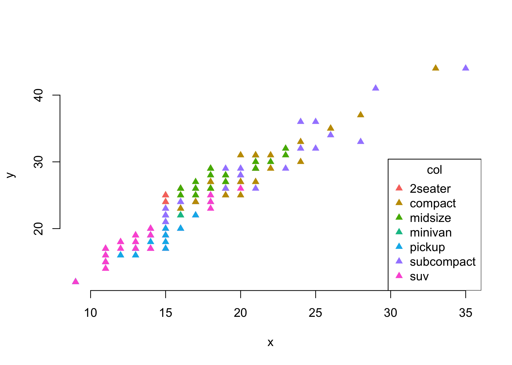

<!-- README.md is generated from README.Rmd. Please edit that file -->

# ggr6

<!-- badges: start -->

[](https://www.tidyverse.org/lifecycle/#experimental)
[](https://travis-ci.org/paleolimbot/ggr6)
[](https://codecov.io/gh/paleolimbot/ggr6?branch=master)
<!-- badges: end -->

The goal of ggr6 is to provide a modern developer-facing implementation
of Wilkinson’s Grammar of Graphics using the best available tools.

## Installation

You can install the development version from
[GitHub](https://github.com/) with:

``` r
# install.packages("remotes")
remotes::install_github("paleolimbot/ggr6")
```

## Example

Currently, there are no exported functions or classes, so to experiment
you’ll have to fork and use `devtools::load_all(".")`.

``` r
graphic <- Graphic$new()$
  add_layer(
    Layer$new(
      ggplot2::mpg,
      mapping = ColumnMappingQuosure$new(x = class, y = hwy, col = displ, pch = drv),
      geom = GeomPoint$new()
    )
  )

Builder$new(graphic, RendererGraphics$new())$render()
```


